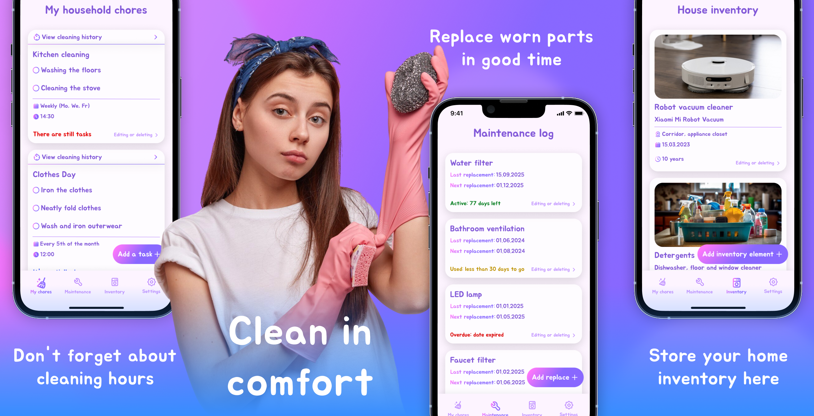
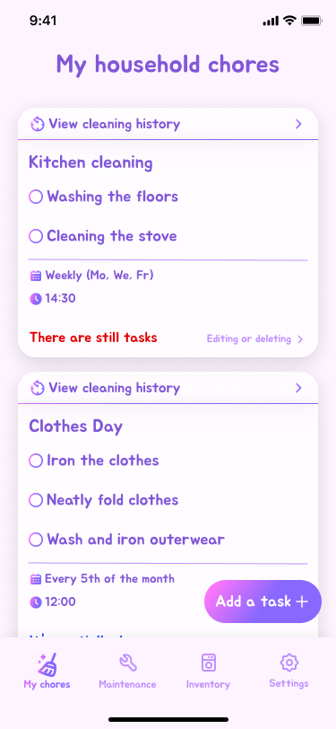
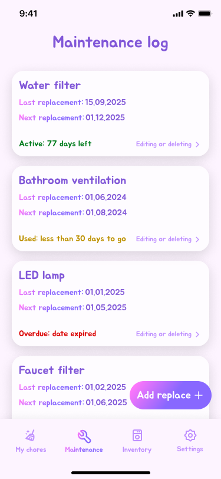
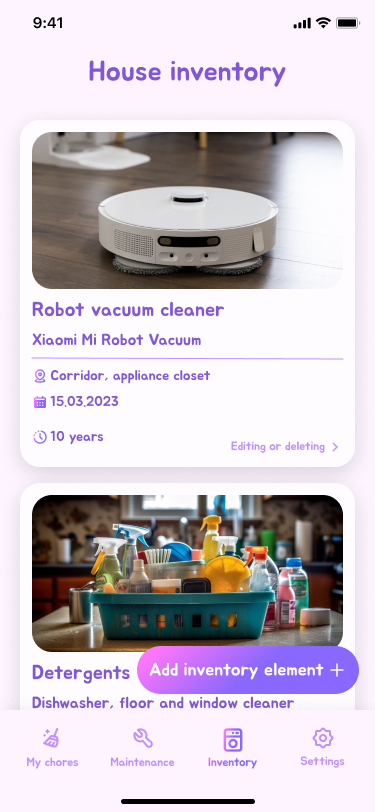

# TidyUp: Clean Starts Here

**TidyUp** is a Flutter app for tracking household chores, inventory, and maintenance. Keep your home organized and never forget a replacement again.



## 🛠️ Technologies

- **Flutter** and **Dart**
- **Provider** — state management
- **Hive** — offline storage for tasks, inventory, maintenance
- **Cupertino pickers** — time/date selection
- **Custom UI** — pastel theme with intuitive icons and alerts
- **Notifications** — reminders for chores and replacements

## 📱 Screenshots

| Chores | Maintenance | Inventory |
|-----------|--------|-------------|
|  |  |  |

## 🚀 How to Run

1. Clone the repo
   ```sh
   git clone https://github.com/NMMustafina/tidyup_clean_starts_here.git
   ```
2. Install all the packages by typing the following command
   ```sh
   flutter pub get
   ```
3. Run the App
